# 6306_CaseStudy_Unit10
Manjula Kottegoda, Ryan Kelly, Jean Jecha  
July 26, 2016  

## Case study

Chulwalar is part of the island group Urbano in the northern hemisphere. They 
are famous for their plants which flower in winter. There are three main plants
that Chulwalar exports.

1. Efak - a leafy bush with white flowers
2. Wuge - a grassy  plant with tiny pink flowers
3. Etel - a flowering tree (red or blue)

Exports generally are higher towards the end of the year. Chulwalar celebrates its independence on 1st December each year. On this day it
is custom to give presents to family and friends. Chulwalar also celebrates the March Equinox as a time of rebirth in the northern hemisphere.  

>In this case study we will be performing analysis and forecasting  exports for **Wuge flowers** for 2014 based on the 2008-2013 As-Is, Planned and Influencing data. We will be analyzing  the data, running it through a variety of forecasting models and picking the best model for the case. In closing we will provide some insight on the data and export forecasting of **Wuge flowers** using the selected model.


## Data Import

First we load the 2008-2013 data provided by the government of Chulwalar. The raw  data files will be as follows.

Data file | Description
------------- | -----------------------------------------------------
ImportedAsIsData | observed exports data. Monthly and Annual breakdown by flower type and totals
ImportedPlanData | desired results data.Monthly and Annual breakdown by flower type and totals
ImportedIndicators | factors influencing the exports 


```r
#------------------------------------------------------------------------------
# Data Import, Vector assignments and Time series transformations done in this module
#------------------------------------------------------------------------------
source('Analysis/Data_Import_module.R') 
str(ImportedAsIsData) # Official Chulwalar observed exports data 
```

```
## 'data.frame':	98 obs. of  8 variables:
##  $ V1: Factor w/ 22 levels "","Apr","Aug",..: 19 9 8 13 2 14 11 10 3 18 ...
##  $ V2: int  2008 2313221 1950131 2346635 2039787 1756964 1458302 1679637 1639670 2882886 ...
##  $ V3: int  2009 2610573 2371327 2743786 2125308 1850073 1836222 1797311 1851968 3271171 ...
##  $ V4: int  2010 2760688 2918333 3227041 1613888 2550157 2317645 1474144 2148521 3898571 ...
##  $ V5: int  2011 3112861 2926663 3294784 2577079 2774068 2378227 2222900 2991787 4151531 ...
##  $ V6: int  2012 3093088 3679308 3433364 2714899 3011767 2726028 2483834 3055655 4200796 ...
##  $ V7: int  2013 4119526 3535744 3560974 3760065 2959933 2787898 2828744 3084113 5107775 ...
##  $ V8: int  2014 4308161 4155378 3924332 3659121 3898758 3313891 3595106 3502426 5619059 ...
```

```r
str(ImportedPlanData) # Official Chulwalar desired results data
```

```
## 'data.frame':	97 obs. of  8 variables:
##  $ V1: Factor w/ 20 levels "","Apr","Aug",..: 19 7 6 11 2 12 9 8 3 15 ...
##  $ V2: int  2008 2243103 2162705 2720911 2011182 1877757 1819924 1682196 1893171 3325711 ...
##  $ V3: int  2009 2547980 2247049 2731156 2020158 2098038 1927995 1783692 1907705 3124040 ...
##  $ V4: int  2010 2965885 2751170 2906493 2383358 2246893 1992851 2023434 2244997 3257717 ...
##  $ V5: int  2011 3113110 2883766 2957893 2601648 2370949 2339881 2105328 2341623 4086297 ...
##  $ V6: int  2012 3895396 3588151 3787240 3036434 2907891 2707822 2619486 3784557 4987460 ...
##  $ V7: int  2013 3580325 3863212 3606083 3213575 3139128 2998610 2785453 3083654 5143757 ...
##  $ V8: int  2014 4474000 4185565 4278119 3985542 3605973 3515173 3269444 3656112 5637391 ...
```

```r
str(ImportedIndicators) # Official Chulwalar influencing factors data
```

```
## 'data.frame':	195 obs. of  8 variables:
##  $ V1: Factor w/ 28 levels "","Apr","Aug",..: 7 16 12 20 2 19 18 17 3 26 ...
##  $ V2: num  2008 97.4 97.8 98.3 98.1 ...
##  $ V3: num  2009 98.3 98.9 98.7 98.8 ...
##  $ V4: num  2010 99 99.4 99.9 100 ...
##  $ V5: num  2011 101 101 102 102 ...
##  $ V6: num  2012 103 104 104 104 ...
##  $ V7: num  2013 104 105 106 105 ...
##  $ V8: num  2014 NA NA NA NA ...
```

```r
#------------------------------------------------------------------------------
# A quick look at the Wuge data vectors
#------------------------------------------------------------------------------
str(WugeAsIsVector) # observed exports raw data
```

```
##  int [1:72] 414571 344579 429907 379606 305697 314582 346800 323618 578252 510031 ...
```

```r
str(WugePlanVector) # desired results raw data
```

```
##  int [1:72] 424190 388688 457796 363828 364246 358439 321255 370153 645618 470648 ...
```

We will now look at the Wuge data that was transformed into a time series. 


```r
#------------------------------------------------------------------------------
# A quick look at the As-is and planned time series data 
#------------------------------------------------------------------------------
str(WugeAsIs)  # observed exports time series data
```

```
##  Time-Series [1:72] from 2008 to 2014: 414571 344579 429907 379606 305697 314582 346800 323618 578252 510031 ...
```

```r
str(WugePlan)  # desired results time series data
```

```
##  Time-Series [1:72] from 2008 to 2014: 424190 388688 457796 363828 364246 358439 321255 370153 645618 470648 ...
```


## Data exploration


```r
#------------------------------------------------------------------------------
# Data analysis code can be found in this module
#------------------------------------------------------------------------------
source('Analysis/Data_Analysis_module.R') 
```

```
## 
##  First we plot the As-Is and Plan data side-by-side to observe a relationship
```

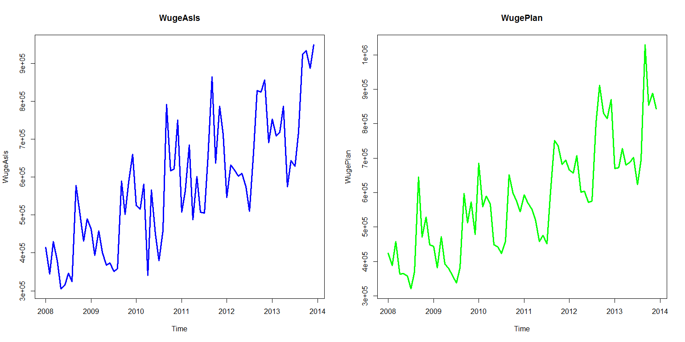<!-- -->


### Correlation between As Is and Plan Data for Wuge 

We can see a possible relationship from the plots above. So the correlation between *As-Is* and *Plan* data is now examined to determine the accuracy of the *Plan*  data. Correlation is a measure of a linear relationship between two variables. 


It is observed that the correlation coefficient is **0.8788474**  indicating a strong relationship between *As-Is* & *Plan* data. In other words planning accuracy is quite good for the Wuge data. Plotting the two time series together confirms the strong relationship.


```r
plot(WugeAsIs, col="blue", main="Wuge As-Is and Plan",  lwd=2)
lines(WugePlan, col="Green", lwd=2)
legend("topleft",lwd=2, pch=1, col=c('blue','green'), c("As-Is","Plan"))
```

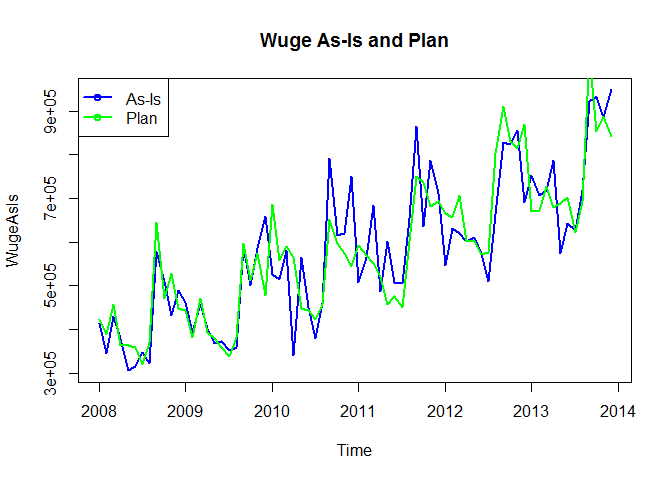<!-- -->

Now we look at the statistics of the Linear fit.

```r
summary(WugeAsIs_lm)
```

```
## 
## Call:
## lm(formula = WugeAsIs ~ WugePlan, data = WugeAsIs)
## 
## Residuals:
##     Min      1Q  Median      3Q     Max 
## -225162  -55052   -2998   32989  204947 
## 
## Coefficients:
##              Estimate Std. Error t value Pr(>|t|)    
## (Intercept) 4.620e+04  3.582e+04    1.29    0.201    
## WugePlan    9.178e-01  5.955e-02   15.41   <2e-16 ***
## ---
## Signif. codes:  0 '***' 0.001 '**' 0.01 '*' 0.05 '.' 0.1 ' ' 1
## 
## Residual standard error: 80220 on 70 degrees of freedom
## Multiple R-squared:  0.7724,	Adjusted R-squared:  0.7691 
## F-statistic: 237.5 on 1 and 70 DF,  p-value: < 2.2e-16
```
With a small p-value the results show a very high planning accuracy. 


### Using STL function we now decompose the data into seasonal, trend and remainder components using loess.

The Wuge time series can be analyzed further after separating it by trend, seasonality and remainder components. 


```r
#------------------------------------------------------------------------------
# Plot data, seasonal, trend, and remainder plots together
#------------------------------------------------------------------------------
plot(WugeAsIs_stl, col="black", main="Wuge As-Is decomposed plots") # Use STL function for decomposition and then plot the separated patterns
```

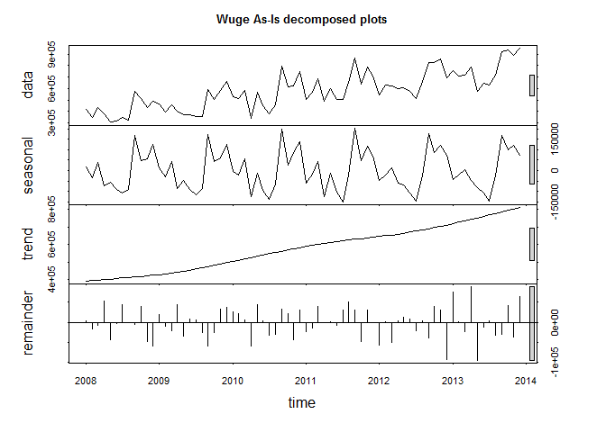<!-- -->

The plots clearly show a pattern with time making the Wuge flower a good candidate for forecasting with high accuracy.

Looking at the trend plot separately for the Wuge flower, an almost linear trend with a mild dip in 2009 and 2012 timeframe can be seen. Possible influenced by external indicators.


```r
options(scipen=5)
plot(WugeAsIs_stl$time.series[,"trend"], ylab="Wuge As Is trend",col="blue")
```

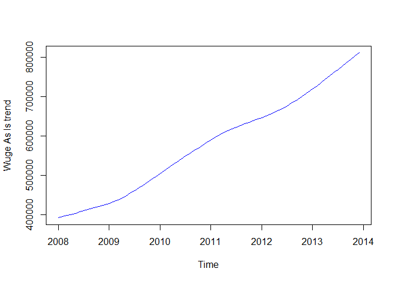<!-- -->


The monthplot (below) shows that September is the highest yielding month while July is the lowest. Also the year-end yields are generally higher.


```r
monthplot(WugeAsIs_stl$time.series[,"seasonal"], main="", ylab="Seasonal" )
```

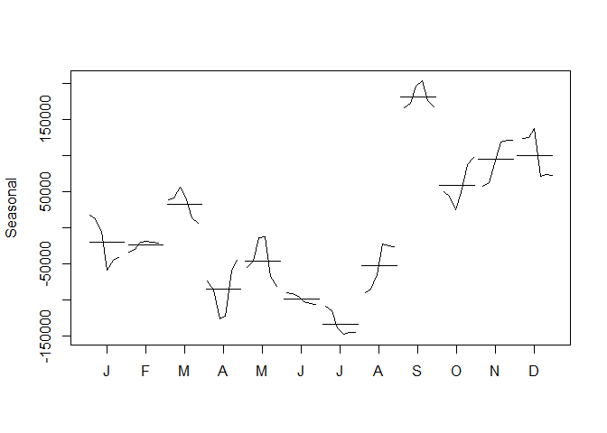<!-- -->


## Correlation with external indicators


The indicators will be converted into individual  vectors and subsequently converted into time series. The correlation of the indicators will then be tested against the As Is exports for the Wuge flower. 


```r
#------------------------------------------------------------------------------
# Correlation of different external indicators code can be found in this module
#------------------------------------------------------------------------------
source('Analysis/External_Indicators_Analysis.R') 
```

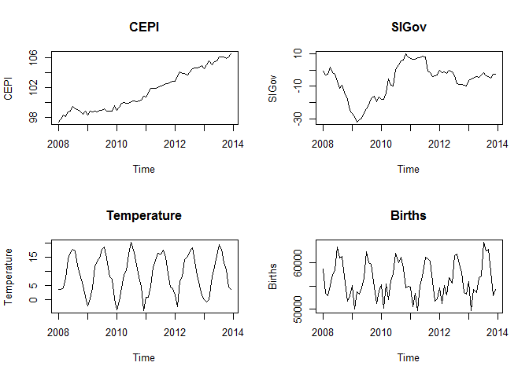<!-- -->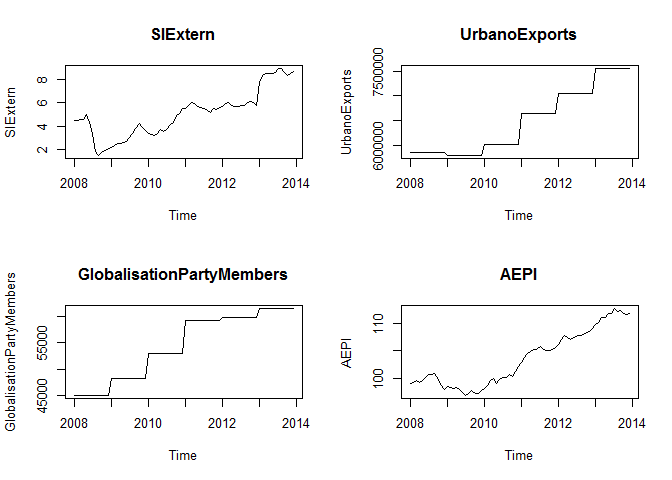<!-- --><!-- -->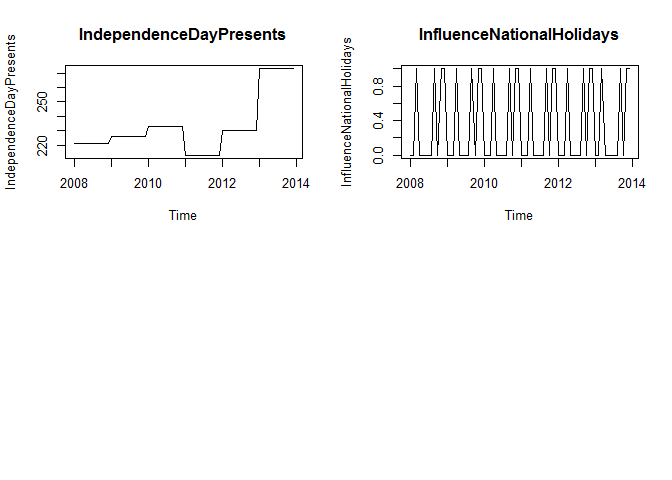<!-- -->

Listed below are the Correlation coefficients for the external indicators in descending order.

external indicators | Correlation Coefficient
------------- | -----------------------------------------------------
Monthly Change in Export Price Index (CEPI)           | 0.7618551
Yearly number of Globalisation Party members in Chulwalar | 0.7193864
Monthly Average Export Price Index for Chulwalar          | 0.7159733
Yearly Exports from Urbano                            | 0.7118468
Monthly Satisfaction Index (SI) external index        | 0.6786552
Chulwalar Index (Total value of all companies in Chulwalar) | 0.5721568
Monthly Producer Price Index (PPI) for Etel in Chulwalar  | 0.4920865
Proposed spending for National Holidays               | 0.4892437
Influence of National Holiday                         | 0.3712288
Monthly Satisfaction Index (SI) government based data | 0.3030266
National Holidays                                     | 0.0650557
Monthly Inflation rate in Chulwalar                   | 0.0319133
Monthly births in Chulwalar                           | -0.0073713
Average monthly temperatures in Chulwalar             | -0.2045082


From the correlation table (above) we can say that the *Monthly Change in Export Price Index (CEPI)*, *Yearly number of Globalisation Party members Index*, *Monthly Average Export Price Index* and *Yearly Exports* all have a moderate influence on the Wuge data. We can also see a general downward trend for 2009 and also a flat trend in 2012 for several indicators which might explain the mild dip we saw in the Wuge linear trend. 

Other indices do not show any particular correlation with Wuge export data.


## Forecasting models with smoothing and related approaches


Now we explore some forecasting models to find which model fits Wuge forecasting the best. 


```r
#------------------------------------------------------------------------------
#  Data Modeling code done in this section
#------------------------------------------------------------------------------
source('Analysis/Data_modeling_module2.R') 
```

```
## SES: This method is more suitable for forecasting data with no trend or seasonal pattern
```

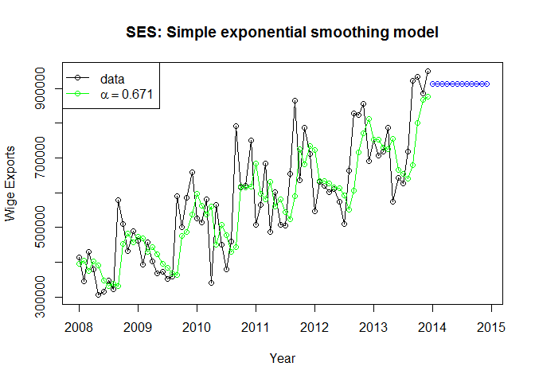<!-- -->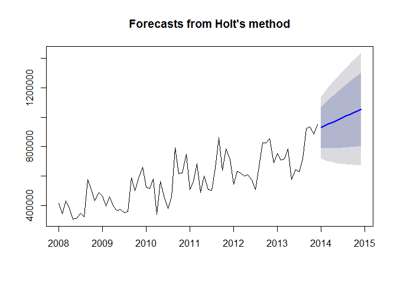<!-- -->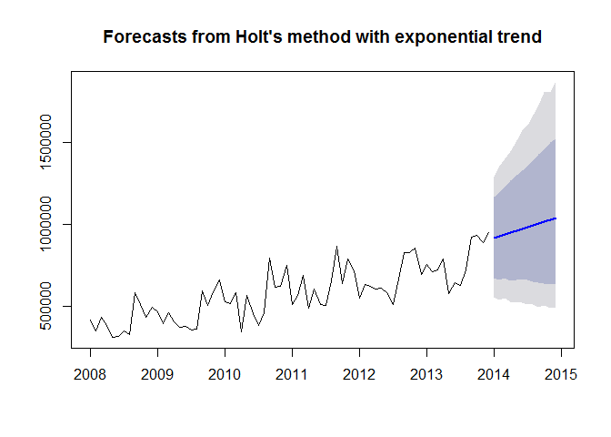<!-- -->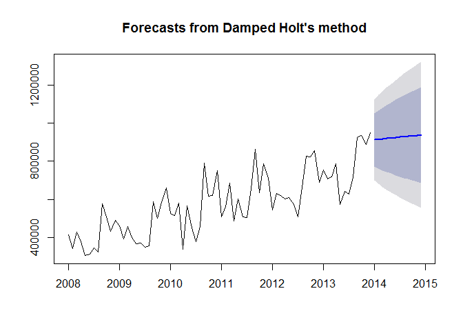<!-- -->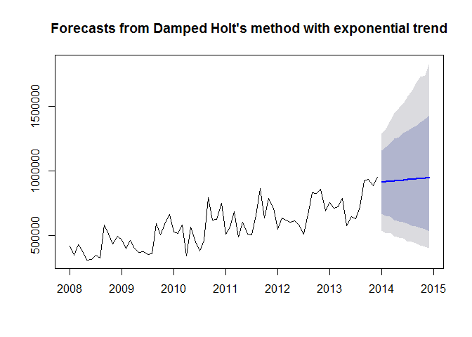<!-- -->

```
## Level and slope can be plotted individually for each of Holt's linear trend methods.
```

<!-- -->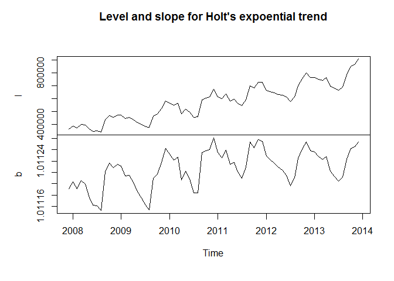<!-- --><!-- -->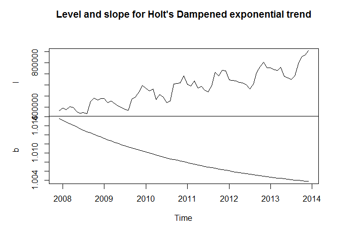<!-- -->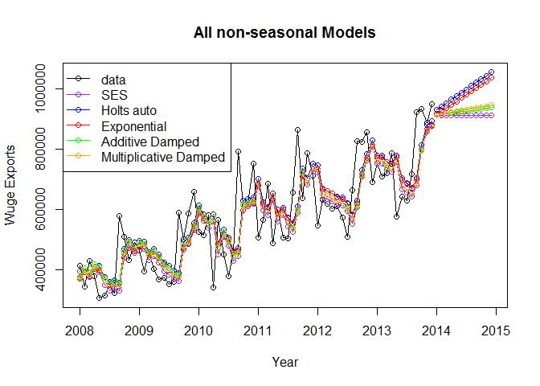<!-- -->

```
## 
##  Now we look at Models that accommodate seasonality
```

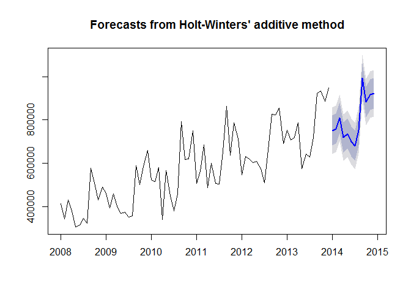<!-- -->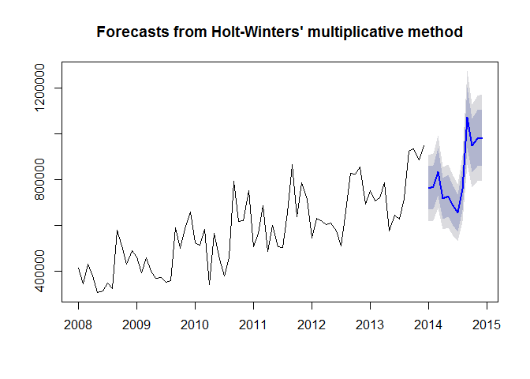<!-- -->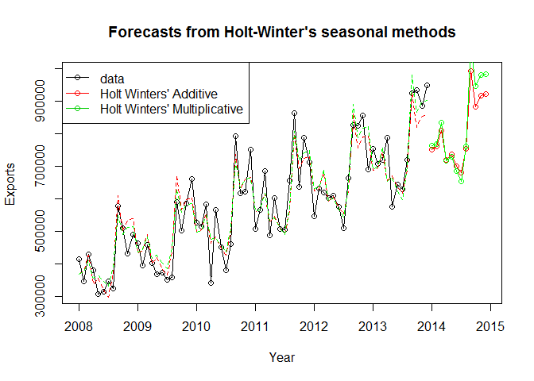<!-- -->

We will now plot the the Akaike’s Information Criterion (AIC/AICc) and the Bayesian Information Criterion (BIC) values for the methods.


```r
#------------------------------------------------------------------------------
#  Error criterion analysis for chosen models done here 
#------------------------------------------------------------------------------
source('Analysis/Error_Criterion_Analysis.R') 
```

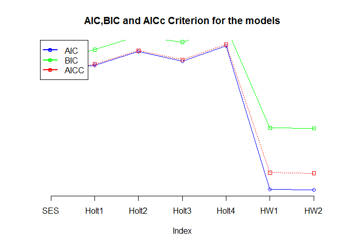<!-- -->

```
## 
##  Plot shows that Holt-Winters seasonal multiplicative model (HW2) gives the most desirable values.
```

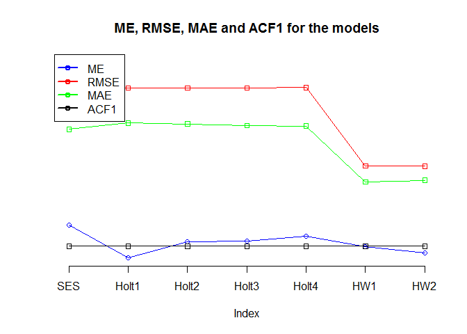<!-- -->

```
## 
##  The plot above also favors Holt-Winters seasonal multiplicative model (HW2) with lower values.
```


We noticed earlier, from the decomposed Seasonal Trend plots, that there was a clear seasonal and linear trend to the Wuge data series. Therefore the Simple Exponential Smoothing (SES) method that gives a flat forecast is not the ideal model for this case.


Holt's linear trend and exponential trend models predict a constant growth rate and usually end up over forecasting. Even when using dampening Holt's linear and exponential methods do not accommodate seasonality all that well. Therefore for the Wuge dataset with a prominent seasonal trend the Holt's linear and exponential models are not a good fit.

Now we consider the Holt-Winter's seasonal methods which have additive, multiplicative versions. The difference being that the additive method fits a constant seasonal variance better. Again referring to the Seasonal Trend decomposed plots we can notice that the seasonal variation was not constant with time. The seasonal variation looks to have a slight increase with time. The Holt-Winter's Multiplicative method with the proportional seasonal variation adjustment seems to fit the Wuge data series the best.
 


```r
#--------------------------------------------
#  Seasonal models side by side (Holt-Winter's Additive vs. Multiplicative)
#------------------------------------------------------------------------------
states <- cbind (Model_hw_1$model$states[,1:3],Model_hw_2$model$states[,1:3])
colnames(states) <- c("level","slope","seasonal","level","slope","seasonal")
plot(states,xlab ="Year", main="Holt-Winter's Additive vs. Multiplicative")
```

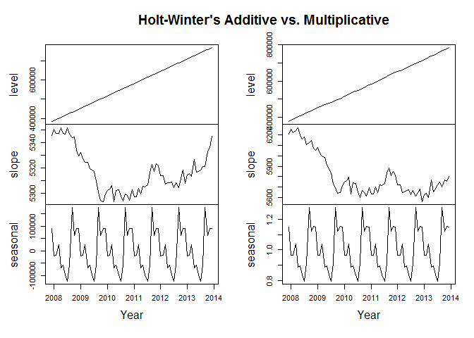<!-- -->


Even on the Holt-Winter's Additive vs. Multiplicative side-by-side (above) we can see the level trend of the Multiplicative shadow the Wuge As-Is data slightly better than the Additive model. Furthermore the mean observed minus predicted (a.k.a mean residual) values of Holt-Winter's Additive model comes out to be **-63.3369775** while the residuals of Holt-Winter's Multiplicative model is much closer to zero and is **-0.0121928**.  In conclusion Holt-Winter's Multiplicative model is the better fit and should in theory will give a better forecast prediction over time.

In conclusion based on the chosen method we can now forecast the Wuge for 2014 as below.


```r
#------------------------------------------------------------------------------
#  Forecast using the preferred model
#------------------------------------------------------------------------------
Model_hw_2$mean # Mean export prediction for the upcoming year
```

```
##            Jan       Feb       Mar       Apr       May       Jun       Jul
## 2014  762281.5  767314.6  833378.6  717572.2  728468.9  685651.2  654309.6
##            Aug       Sep       Oct       Nov       Dec
## 2014  759936.1 1070161.2  946855.2  980048.4  983372.1
```

```r
plot(Model_hw_2$mean,xlab ="Year", main="Holt-Winter's Multiplicative prediction for 2014", ylab="Wuge export amount")
```

<!-- -->
